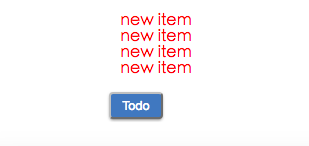

# Flux 应用架构
**Flux**是Facebook用来构建客户端Web应用的一种应用架构体系。它是一种类似MVC的架构，但是它更加简单、清晰，是一种单向数据流的架构设计。

**Note**

请事先对[React](http://facebook.github.io/react/)和[ES6](http://es6.ruanyifeng.com/)进行了解。

本文采用Facebook官方的[Flux](https://github.com/facebook/flux)。

## 快速入门
```
$ git clone https://github.com/ipluser/react-flux-demo.git
$ cd react-flux-demo
$ npm start
```

浏览器将会自动打开一个新的网页（若没有，请访问`http://127.0.0.1:8080`）：



## 核心概念
Flux应用主要分为四个主要的部门：Views, Actions, Dispatcher, Stores.

| Name | Description |
|:-----|:------------|
| Views | 视图层，React组件 |
| Actions | 行为动作层，视图层触发的动作，例如`click event` |
| Dispatcher | 分发中心，注册/接受动作，调用数据流向中的回调函数 |
| Stores | 数据层，管理应用状态，广播通知Views状态发生改变 |


单向数据流是Flux应用的核心。Dispatcher, Stores, Views是独立的输入和输出节点，而Action是一个包含数据和动作类型的简单对象。

## Views
打开项目入口文件***main.jsx***:

```js
// public/scripts/main.jsx
import React from 'react';
import ReactDOM from 'react-dom';
import TodoController from './components/todoController.jsx';

ReactDOM.render(<TodoController />, document.body);
```

上面代码中采用了[ReactJS Controller View](http://blog.andrewray.me/the-reactjs-controller-view-pattern/)模式，一个"Controller View"是应用中最顶层的组件，它管理着所有应用状态，并以属性方式传递给子组件。 接下来我们看看***toToController.jsx***:

```js
// public/scripts/components/todoController.jsx
import React from 'react';

import TodoAction from '../actions/todoAction.js';
import TodoStore from '../stores/todoStore.js';
import Todo from './todo.jsx';

export default class TodoController extends React.Component {
  constructor(props) {
    super(props);
  }

  newItem() {
    TodoAction.addItem('new item');
  }

  render() {
    return <Todo newItem={this.newItem} />;
  }
}
```

正如你所看到的，**TodoController**仅仅给**Todo**子组件指定了*newItem*动作。**Todo**接收属性和渲染组件：

```js
// public/scripts/components/todo.jsx
import React from 'react';

import '../../styles/components/todo.scss';

export default function Todo(props) {
  let list = props.items.map((item, index) => {
    return <li className="color--red" key={index}>{item}</li>;
  });

  return (
    <div className="todo">
      <ul>{list}</ul>
      <button className="todo__click-btn" onClick={props.newItem}>Todo</button>
    </div>
  );
}
```

一旦点击todo按钮，**TodoController**将会触发一个**addItem**动作。

## Actions
**TodoAction**将数据和动作类型传递给**Dispatcher**去分发数据流:

```js
// public/scripts/actions/todoAction.js
import AppDispatcher from '../dispatcher.js';
import TodoConstant from '../constants/todoConstant.js';

class TodoAction {
  addItem(text) {
    AppDispatcher.dispatch({
      actionType: TodoConstant.ADD_ITEM,
      text
    });
  }
}

export default new TodoAction();
```

**todoConstants.js**是一个包含所有动作类型的常量对象:

```js
// public/scripts/constants/todoConstant.js
export default {
  ADD_ITEM: 'TODO_ADD_ITEM'
};
```

## Dispatcher
**Dispatcher**一个分发中心，它管理着应用的所有数据流向。每一个**Store**在这里注册，并提供一个回调函数:

```js
// public/scripts/dispatcher.js
import { Dispatcher } from 'flux';

import TodoStore from './stores/todoStore';
import TodoConstant from './constants/todoConstant';

const AppDispatcher = new Dispatcher();

TodoStore.dispatchToken = AppDispatcher.register(payload => {
  switch (payload.actionType) {
    case TodoConstant.ADD_ITEM:
      TodoStore.addItem(payload.text);
      break;
    default:
  }
});

export default AppDispatcher;
```

上面代码中可以看到，当**TodoAction**提供给**Dispatcher**一个新动作时，**TodoStore**将会通过注册时的回调函数接受动作的行为。

## Stores
**TodoStore**包含状态和业务逻辑。它的职责有点类似MVC中的*model*：

```js
// public/scripts/stores/todoStore.js
import EventEmitter from 'events';

class TodoStore extends EventEmitter {
  constructor() {
    super();
    this.items = [];
  }

  getAll() {
    return this.items;
  }

  addItem(text) {
    this.items.push(text);
    this.change();
  }

  change() {
    this.emit('change');
  }

  addListener(name, callback) {
    this.on(name, callback);
  }

  removeListener(name, callback) {
    this.removeListener(name, callback);
  }
}

export default new TodoStore();
```

## Views, again
再回到**TodoController**中，我们初始化应用的状态，同时监听**Store**的状态改变事件：

```js
// public/scripts/components/todoController.jsx
import React from 'react';

import TodoAction from '../actions/todoAction.js';
import TodoStore from '../stores/todoStore.js';
import Todo from './todo.jsx';

export default class TodoController extends React.Component {
  constructor(props) {
    super(props);
    this.state = { items: TodoStore.getAll() };
    this.onListChange = this.onListChange.bind(this);
  }

  componentDidMount() {
    TodoStore.addListener('change', this.onListChange);
  }

  componentWillUnmount() {
    TodoStore.removeListener('change', this.onListChange);
  }

  onListChange() {
    this.setState({
      items: TodoStore.getAll()
    });
  }

  newItem() {
    TodoAction.addItem('new item');
  }

  render() {
    return <Todo items={this.state.items} newItem={this.newItem} />;
  }
}
```

一旦**TodoController**接受到应用状态改变，将会触发**Todo**重新渲染。

## 参考
- [Facebokk Flux](https://facebook.github.io/flux/docs/overview.html)
- [Andrew - Controller-View](http://blog.andrewray.me/the-reactjs-controller-view-pattern/)
- [ruanyifeng - Flux 架构入门教程](http://www.ruanyifeng.com/blog/2016/01/flux.html)

## 源代码
[react-flux-demo](https://github.com/ipluser/react-flux-demo)
