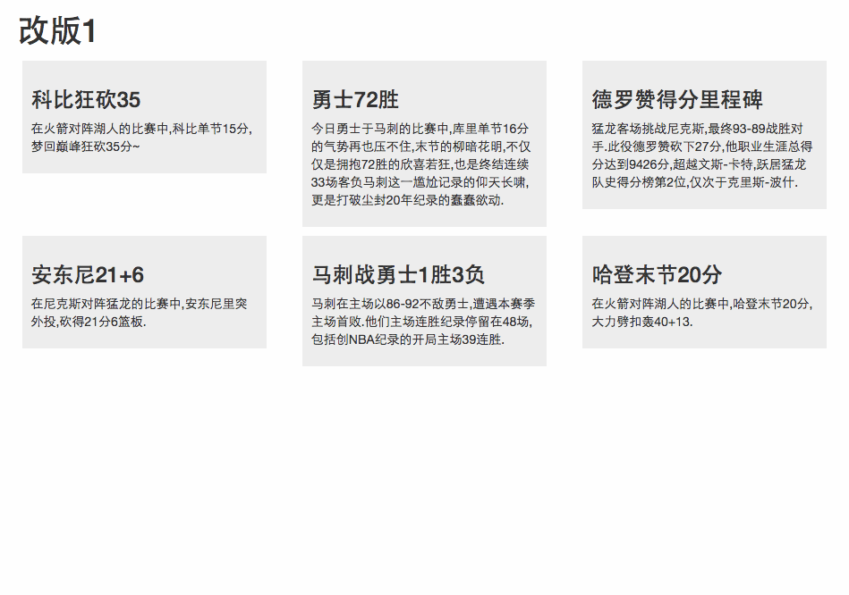
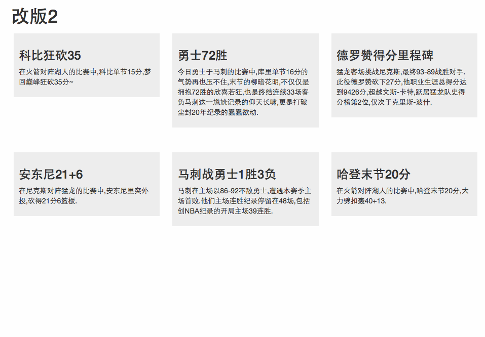

# 多列等高
高度不一的列以等高方式布局。

## 需求
设计师说某页面的新闻介绍，由于新闻内容不同导致显示区域的高度不一致，现需要使其高度视觉上保持一致。小加同学觉得必须迅速解决，让设计师妹妹知道我们程序师哥哥的威武。原型设计稿大致如下:


## 初版
### 思路
直接使用bootstrap的col-*来实现这个简单的布局就OK啦～

### HTML
```html
  <div class="section sample-1">
    <h1 class="section__title">初版</h1>
    <div class="section__items row">
      <div class="section__item col-xs-12 col-sm-6 col-md-4">
        <div class="section__item-wrap">
          <h3>科比狂砍35</h3>
          <p>在火箭对阵湖人的比赛中,科比单节15分,梦回巅峰狂砍35分~</p>
        </div>
      </div>
      <div class="section__item col-xs-12 col-sm-6 col-md-4">
        <div class="section__item-wrap">
          <h3>勇士72胜</h3>
          <p>今日勇士于马刺的比赛中,库里单节16分的气势再也压不住,末节的柳暗花明,不仅仅是拥抱72胜的欣喜若狂,也是终结连续33场客负马刺这一尴尬记录的仰天长啸,更是打破尘封20年纪录的蠢蠢欲动.</p>
        </div>
      </div>
      <div class="section__item col-xs-12 col-sm-6 col-md-4">
        <div class="section__item-wrap">
          <h3>德罗赞得分里程碑</h3>
          <p>猛龙客场挑战尼克斯,最终93-89战胜对手.此役德罗赞砍下27分,他职业生涯总得分达到9426分,超越文斯-卡特,跃居猛龙队史得分榜第2位,仅次于克里斯-波什.</p>
        </div>
      </div>
      <div class="section__item col-xs-12 col-sm-6 col-md-4">
        <div class="section__item-wrap">
          <h3>安东尼21+6</h3>
          <p>在尼克斯对阵猛龙的比赛中,安东尼里突外投,砍得21分6篮板.</p>
        </div>
      </div>
      <div class="section__item col-xs-12 col-sm-6 col-md-4">
        <div class="section__item-wrap">
          <h3>马刺战勇士1胜3负</h3>
          <p>马刺在主场以86-92不敌勇士,遭遇本赛季主场首败.他们主场连胜纪录停留在48场,包括创NBA纪录的开局主场39连胜.</p>
        </div>
      </div>
      <div class="section__item col-xs-12 col-sm-6 col-md-4">
        <div class="section__item-wrap">
          <h3>哈登末节20分</h3>
          <p>在火箭对阵湖人的比赛中,哈登末节20分,大力劈扣轰40+13.</p>
        </div>
      </div>
    </div>
  </div>
```

### CSS
```css
  .section {
    margin-bottom: 100px;
  }
  .section__items {
    width: 100%;
  }
  .section__item-wrap {
    margin: 5px;
    padding: 10px;
    background-color: #EEE;
  }
```

### 效果图


### 吐槽
什么情况，一行三个、二个，这看起来太乱了，肯定会遭设计师鄙视的～ 必须采用淫技解决这个问题，让设计师妹妹崇拜哥～
<br><br><br><br>
<em style="color: red;">分割线来咯～ 你能够尝试着解决这个问题吗？</em>

-----
<br>

## 改版1
### 思路
由于内容不同的新闻其高度不一致，使元素左浮动卡在高度最大的右边，可以使用`clear: left;`来解决这个问题。

### HTML
```html
  <div class="section sample-2">
    <h1 class="section__title">改版1</h1>
    <div class="section__items row">
      <div class="section__item col-xs-12 col-sm-6 col-md-4">
        <div class="section__item-wrap">
          <h3>科比狂砍35</h3>
          <p>在火箭对阵湖人的比赛中,科比单节15分,梦回巅峰狂砍35分~</p>
        </div>
      </div>
      <div class="section__item col-xs-12 col-sm-6 col-md-4">
        <div class="section__item-wrap">
          <h3>勇士72胜</h3>
          <p>今日勇士于马刺的比赛中,库里单节16分的气势再也压不住,末节的柳暗花明,不仅仅是拥抱72胜的欣喜若狂,也是终结连续33场客负马刺这一尴尬记录的仰天长啸,更是打破尘封20年纪录的蠢蠢欲动.</p>
        </div>
      </div>
      <div class="section__item col-xs-12 col-sm-6 col-md-4">
        <div class="section__item-wrap">
          <h3>德罗赞得分里程碑</h3>
          <p>猛龙客场挑战尼克斯,最终93-89战胜对手.此役德罗赞砍下27分,他职业生涯总得分达到9426分,超越文斯-卡特,跃居猛龙队史得分榜第2位,仅次于克里斯-波什.</p>
        </div>
      </div>
      <div class="section__item col-xs-12 col-sm-6 col-md-4">
        <div class="section__item-wrap">
          <h3>安东尼21+6</h3>
          <p>在尼克斯对阵猛龙的比赛中,安东尼里突外投,砍得21分6篮板.</p>
        </div>
      </div>
      <div class="section__item col-xs-12 col-sm-6 col-md-4">
        <div class="section__item-wrap">
          <h3>马刺战勇士1胜3负</h3>
          <p>马刺在主场以86-92不敌勇士,遭遇本赛季主场首败.他们主场连胜纪录停留在48场,包括创NBA纪录的开局主场39连胜.</p>
        </div>
      </div>
      <div class="section__item col-xs-12 col-sm-6 col-md-4">
        <div class="section__item-wrap">
          <h3>哈登末节20分</h3>
          <p>在火箭对阵湖人的比赛中,哈登末节20分,大力劈扣轰40+13.</p>
        </div>
      </div>
    </div>
  </div>
```

### CSS
```css
  .section {
    margin-bottom: 100px;
  }
  .section__items {
    width: 100%;
  }
  .section__item-wrap {
    margin: 5px;
    padding: 10px;
    background-color: #EEE;
  }
  @media (min-width: 768px) {
    .sample-2 .section__item:nth-child(odd) {
      clear: left;
    }
  }
  @media (min-width: 992px) {
    .sample-2 .section__item:nth-child(odd) {
      clear: none;
    }
    .sample-2 .section__item:nth-child(4) {
      clear: left;
    }
  }
```

### 效果图


## 改版2
### 思路
参照[不规整元素的宽高等比例](http://ipluser.github.io/speechless/#docs/css/width-height-scale)，预估高度范围，使用`padding`属性完成～

### HTML
```html
  <div class="section sample-3">
    <h1 class="section__title">改版2</h1>
    <div class="section__items row">
      <div class="section__item col-xs-12 col-sm-6 col-md-4">
        <div class="section__item-wrap">
          <h3>科比狂砍35</h3>
          <p>在火箭对阵湖人的比赛中,科比单节15分,梦回巅峰狂砍35分~</p>
        </div>
      </div>
      <div class="section__item col-xs-12 col-sm-6 col-md-4">
        <div class="section__item-wrap">
          <h3>勇士72胜</h3>
          <p>今日勇士于马刺的比赛中,库里单节16分的气势再也压不住,末节的柳暗花明,不仅仅是拥抱72胜的欣喜若狂,也是终结连续33场客负马刺这一尴尬记录的仰天长啸,更是打破尘封20年纪录的蠢蠢欲动.</p>
        </div>
      </div>
      <div class="section__item col-xs-12 col-sm-6 col-md-4">
        <div class="section__item-wrap">
          <h3>德罗赞得分里程碑</h3>
          <p>猛龙客场挑战尼克斯,最终93-89战胜对手.此役德罗赞砍下27分,他职业生涯总得分达到9426分,超越文斯-卡特,跃居猛龙队史得分榜第2位,仅次于克里斯-波什.</p>
        </div>
      </div>
      <div class="section__item col-xs-12 col-sm-6 col-md-4">
        <div class="section__item-wrap">
          <h3>安东尼21+6</h3>
          <p>在尼克斯对阵猛龙的比赛中,安东尼里突外投,砍得21分6篮板.</p>
        </div>
      </div>
      <div class="section__item col-xs-12 col-sm-6 col-md-4">
        <div class="section__item-wrap">
          <h3>马刺战勇士1胜3负</h3>
          <p>马刺在主场以86-92不敌勇士,遭遇本赛季主场首败.他们主场连胜纪录停留在48场,包括创NBA纪录的开局主场39连胜.</p>
        </div>
      </div>
      <div class="section__item col-xs-12 col-sm-6 col-md-4">
        <div class="section__item-wrap">
          <h3>哈登末节20分</h3>
          <p>在火箭对阵湖人的比赛中,哈登末节20分,大力劈扣轰40+13.</p>
        </div>
      </div>
    </div>
  </div>
```

### CSS
```css
  .section {
    margin-bottom: 100px;
  }
  .section__items {
    width: 100%;
  }
  .section__item-wrap {
    margin: 5px;
    padding: 10px;
    background-color: #EEE;
  }
  @media (min-width: 768px) {
    .sample-3 .section__item {
      position: relative;
      padding-top: 25%;
    }

    .sample-3 .section__item-wrap {
      position: absolute;
      top: 0;
      margin: 5px;
    }
  }
  @media (min-width: 1200px) {
    .sample-3 .section__item {
      position: relative;
      padding-top: 20%;
    }
  }
```

### 效果图


## 改版3
### 思路
使用神器`flexbox`，它能简单的搞定一切～

### HTML
```html
  <div class="section sample-4">
    <h1 class="section__title">改版3</h1>
    <div class="section__items row">
      <div class="section__item col-xs-12 col-sm-6 col-md-4">
        <div class="section__item-wrap">
          <h3>科比狂砍35</h3>
          <p>在火箭对阵湖人的比赛中,科比单节15分,梦回巅峰狂砍35分~</p>
        </div>
      </div>
      <div class="section__item col-xs-12 col-sm-6 col-md-4">
        <div class="section__item-wrap">
          <h3>勇士72胜</h3>
          <p>今日勇士于马刺的比赛中,库里单节16分的气势再也压不住,末节的柳暗花明,不仅仅是拥抱72胜的欣喜若狂,也是终结连续33场客负马刺这一尴尬记录的仰天长啸,更是打破尘封20年纪录的蠢蠢欲动.</p>
        </div>
      </div>
      <div class="section__item col-xs-12 col-sm-6 col-md-4">
        <div class="section__item-wrap">
          <h3>德罗赞得分里程碑</h3>
          <p>猛龙客场挑战尼克斯,最终93-89战胜对手.此役德罗赞砍下27分,他职业生涯总得分达到9426分,超越文斯-卡特,跃居猛龙队史得分榜第2位,仅次于克里斯-波什.</p>
        </div>
      </div>
      <div class="section__item col-xs-12 col-sm-6 col-md-4">
        <div class="section__item-wrap">
          <h3>安东尼21+6</h3>
          <p>在尼克斯对阵猛龙的比赛中,安东尼里突外投,砍得21分6篮板.</p>
        </div>
      </div>
      <div class="section__item col-xs-12 col-sm-6 col-md-4">
        <div class="section__item-wrap">
          <h3>马刺战勇士1胜3负</h3>
          <p>马刺在主场以86-92不敌勇士,遭遇本赛季主场首败.他们主场连胜纪录停留在48场,包括创NBA纪录的开局主场39连胜.</p>
        </div>
      </div>
      <div class="section__item col-xs-12 col-sm-6 col-md-4">
        <div class="section__item-wrap">
          <h3>哈登末节20分</h3>
          <p>在火箭对阵湖人的比赛中,哈登末节20分,大力劈扣轰40+13.</p>
        </div>
      </div>
    </div>
  </div>
```

### CSS
```css
  .section {
    margin-bottom: 100px;
  }
  .section__items {
    width: 100%;
  }
  .section__item-wrap {
    margin: 5px;
    padding: 10px;
    background-color: #EEE;
  }
  .sample-4 .section__items {
    display: -webkit-flex;
    display: flex;
    -webkit-flex-wrap: wrap;
    flex-wrap: wrap;
  }
```

### 效果图


## 关键知识点
> [clear](http://www.w3school.com.cn/cssref/pr_class_clear.asp)
>>w3school

> [flex](http://www.ruanyifeng.com/blog/2015/07/flex-grammar.html)
>>ruanyifeng

## 资源
### [在线测试](http://ipluser.github.io/speechless/public/view/css/cols-equal-height.html)
### [源代码](https://github.com/ipluser/speechless/blob/gh-pages/public/view/css/cols-equal-height.html)