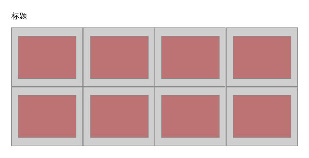

# 不规整元素的宽高等比例
在不同屏幕情况中不同宽高的元素都以相同等比例、等宽和等高方式展示。

## 需求
设计师希望页面的图片区域，以宽高为2:1比例且所有图片的等宽和等高的方式展示。小加同学觉得设计师这需求太容易，分分钟搞定，拿到图片后便开始刷刷的撸代码。原型设计稿大致如下:<br>


## bootstrap 栅格系统
### 思路
每个图片区域宽度为父元素宽度的25%，图片的宽度设置100%，其高度根据宽度等比例自动缩放（小加以为图片的宽高应该是同比例的），这样就可以适应屏幕达到要求咯～

### HTML
```html
  <div class="section">
    <h1 class="section__title">初版</h1>
    <div class="section__images row">
      <div class="section__image-wrap col-xs-3">
        
      </div>
      <div class="section__image-wrap col-xs-3">
        
      </div>
      <div class="section__image-wrap col-xs-3">
        
      </div>
      <div class="section__image-wrap col-xs-3">
        
      </div>
      <div class="section__image-wrap col-xs-3">
        
      </div>
      <div class="section__image-wrap col-xs-3">
        
      </div>
      <div class="section__image-wrap col-xs-3">
        
      </div>
      <div class="section__image-wrap col-xs-3">
        
      </div>
    </div>
  </div>
```

### CSS
```css
  .section {
      margin-bottom: 100px;
    }
  .section__image-wrap {
    display: inline-block;
    float: left;
    padding: 10px;
  }
  .section__image {
    width: 100%;
  }
```

### 效果图


### 吐槽
OMG，这这这...是什么情况啊～ 一行四个，怎么第二行就一个，前面三个位置都是空的，这不可能啊！等等，我需要静静～ 貌似图片不是同比例的宽高的，**这让我怎么搞，手动设置图片高度为50%？实时计算高度然后动态设置图片高度？<br><br><br>
<em style="color: red;">分割线来咯～ 你能够尝试着解决这个问题吗？</em>

-----
<br><br>

## padding + position
### 思路
使用padding百分比的方式来实现不规整元素宽高等比例。padding-left/right设置百分比时，是参考父元素的宽度；想当然的padding-top/bottom设置百分比时，是参考父元素的高度，Oh no no no... 它也是参考父元素的宽度哦。

### CSS
```css
  .section {
    margin-bottom: 100px;
  }
  .section__image-wrap {
    display: inline-block;
    float: left;
    padding: 10px;
  }
  .section__image {
    width: 100%;
  }
  .section-revision--padding .section__image-wrap {
    position: relative;
    padding: 12.5% 0 0 25%;
  }
  .section-revision--padding .section__image {
    position: absolute;
    top: 0;
    left: 0;
    height: 100%;
    padding: 10px;
  }
```

### 效果图


## 效果对比图


## 关键知识点
> | padding value | description                                       |
> |:------------- | :------------------------------------------------ |
> | auto          | 浏览器计算内边距。                                   |
> | length        | 规定以具体单位计的内边距值，比如像素、厘米等。默认值是0px。 |
> | %             | <mark>规定基于父元素的宽度的百分比的内边距。</mark>      |
> | inherit       | 规定应该从父元素继承内边距。                           |
>>w3school

## 资源
### [在线测试](http://ipluser.github.io/speechless/public/view/css/width-height-scale.html)
### [源代码](https://github.com/ipluser/speechless/blob/gh-pages/public/view/css/width-height-scale.html)