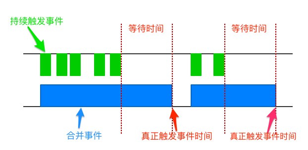
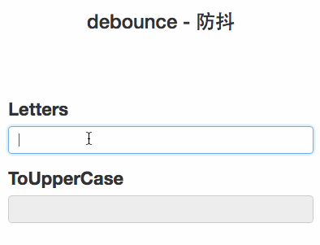
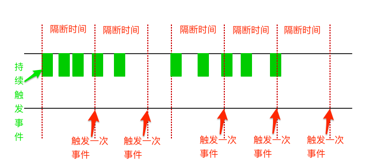
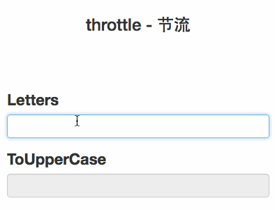

# 防抖和节流
窗口的`resize`、`scroll`，输入框内容校验等操作时，如果这些操作处理函数较为复杂或页面频繁重渲染等操作时，如果事件触发的频率无限制，会加重浏览器的负担，导致用户体验非常糟糕。此时我们可以采用debounce（防抖）和throttle（节流）的方式来减少触发的频率，同时又不影响实际效果。

## debounce 防抖
debounce（防抖），简单来说就是防止抖动。



从上图中我们可以看到，当持续触发事件时，**debounce**会合并事件且不会去触发事件，当一定时间内没有触发再这个事件时，才真正去触发事件～ 一起来实现个简单的debounce：

```js
function debounce(fn, delay) {
  var ctx;
  var args;
  var timer = null;

  var later = function () {
    fn.apply(ctx, args);
    // 当事件真正执行后，清空定时器
    timer = null;
  };

  return function () {
    ctx = this;
    args = arguments;
    // 当持续触发事件时，若发现事件触发的定时器已设置时，则清除之前的定时器
    if (timer) {
      clearTimeout(timer);
      timer = null;
    }

    // 重新设置事件触发的定时器
    timer = setTimeout(later, delay);
  };
}
```

**效果图:**



## throttle 节流
throttle（节流），当持续触发事件时，保证隔间时间触发一次事件。



上图中绿色块表示触发一次事件，持续触发事件时，**throttle**会合并一定时间内的事件，并在该时间结束时真正去触发一次事件～ 一起来看看throttle的简单实现：

```js
function throttle(fn, delay) {
  var ctx;
  var args;
  // 记录上次触发事件
  var previous = Date.now();

  var later = function () {
    fn.apply(ctx, args);
  };

  return function () {
    ctx = this;
    args = arguments;
    var now = Date.now();
    // 本次事件触发与上一次的时间比较
    var diff = now - previous - delay;

    // 如果隔间时间超过设定时间，即再次设置事件触发的定时器
    if (diff >= 0) {
      // 更新最近事件触发的时间
      previous = now;
      setTimeout(later, delay);
    }
  };
}
```

**效果图:**



## 总结
根据实际业务场景，合理的利用debounce（防抖）和throttle（节流）可以优化性能和提高用户体验。两者间的核心区别就在于持续触发事件时，前者合并事件并在最后时间去触发事件，而后者则是隔间时间触发一次～

## 关键知识点
> [setTimeout 定时器](http://www.w3school.com.cn/jsref/met_win_settimeout.asp)
>>w3school

> [Closure 闭包](http://www.ruanyifeng.com/blog/2009/08/learning_javascript_closures.html)
>>ruanyifeng

## 资源
### [在线测试](http://ipluser.github.io/speechless/public/view/js/debounce-throttle.html)
### [源代码](https://github.com/ipluser/speechless/blob/gh-pages/public/view/js/debounce-throttle.html)
