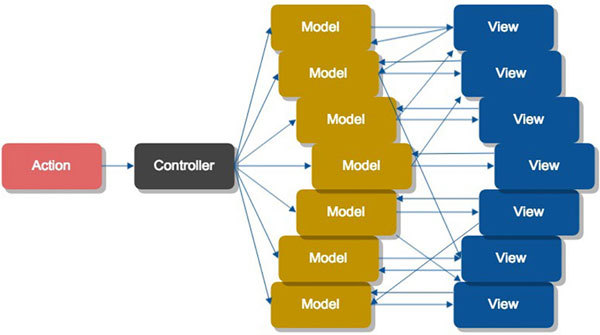
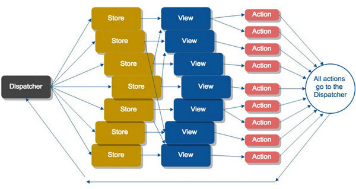

# 初识React

依稀记得2015那年参加线下活动，第一次听说**React**这个词语，当时的主讲人是**郭达峰**，他播放了一个关于ember、angular及react的性能对比视频： [React.js Conf 2015](https://www.youtube.com/watch?v=z5e7kWSHWTg)。那时我主要从事**angularjs**开发，深知angular在页面复杂时性能问题的疼，看到这个视频的性能对比后瞬间被React折服。现在我们一起再回顾下React~

## 视图库

React不同于AngularJS、Backbone等MVC框架，它是Facebook推出的一个用来构建用户界面的Javascript库，只专注于view层（即MVC中的V），是一个用于构建前端可复用UI组件的库，同时，当数据发生变化时，React会及时有效地更新和渲染相应的组件。对于越来越复杂的前端界面，尤其是对于数据不断变化的web应用，React实现了将变化的数据高效无误的反映在页面上。

## 视图状态机

在传统Web应用中，当数据改变时需要同步DOM节点的改变，React
把界面看做一个状态机：

`UI = f(states)`

当界面状态发生变化时，React会根据给定的状态及时有效地更新和渲染相应的组件，相同的状态其渲染表现一致。

## JSX

在传统的Web应用中采用模板或HTML指令构建用户界面，但React采用了JSX（一种扩展了ECMAScript的类似XML语法）声明式的写法，它优势超过模板：

- JavaScript是一种灵活的、扩展性高的编程语言
- 统一页面标记语言和视图逻辑，使视图更易于扩展和维护
- 没有字符串的拼接，将视图内容融入JavaScript中，减少XSS漏洞的存在

## 高效更新

当应用状态发生改变时，React能高效地更新和渲染组件及界面：

- 虚拟DOM：通过Javascript在内存中用轻量级的描述对象表示真实DOM节点的结构和样式
- 差量算法：高效快速地生成一个最小集的Diff树
- 批量更新：将状态的多次更新有效地合并为一次更新操作

React利用虚拟DOM来描述一个真实DOM，当应用状态发生改变时，通过高效的差量算法生产一个最小集的Diff树，同时合并多次更新操作为一次，减少了对实际DOM的直接操作，从而大大的提升了性能。

## 事件代理

React采用了事件代理机制，它能够保持事件冒泡的一致性，跨浏览器的执行，甚至可以在IE8中使用HTML5的事件。React实现了一个“合成事件”层，这个事件层消除了IE与W3C标准实现之间的兼容问题，通过JSX这种方式绑定的事件都是绑定到“合成事件”。“合成事件”会以事件委托的方式绑定到组件最上层，并且在组件卸载的时候自动销毁绑定的事件。

## Flux单向流

**Flux**是Facebook推出的一种应用架构，他推崇一种单向的数据流动：

| Name | Description |
|:-----|:------------|
| Views | 视图层，React组件 |
| Actions | 行为动作层，视图层触发的动作，例如`click event` |
| Dispatcher | 分发中心，注册/接受动作，调用数据流向中的回调函数 |
| Stores | 数据层，管理应用状态，广播通知Views状态发生改变 |

我们一起看下MV*和Flux应用架构下的数据流向关系图：

**MV\***

**Flux**

从上面图中我们可以看到，Flux单向数据流使应用状态变得可预测和可追踪，能够很方便地达到以下目标：

- 易测试性、可重现性
- 基于时间旅行的诊断调试
- 撤销与重放功能

## isomorphic/universal

React能在服务端中运行，以达到SEO优化、体验优化和性能优化等目的；同时我们只需学习React一次，就能够在任何地方编写，你可以使用它编写Web、手机、VR等应用。 

